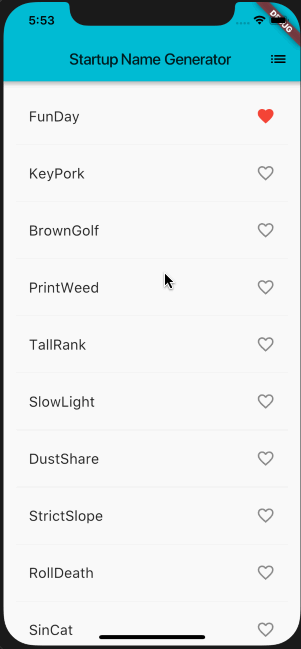

# Flutter Notes

## Note 1

- [Flutter 中文网](https://flutterchina.club/)

### 安装

安装，配置环境，略。

下载 SDK 安装包，在 Mac 上解压即可，再配置 PATH 路径。

检查是否配置安装齐全：`$ flutter doctor`

升级 flutter: `$ flutter upgrade`

创建 flutter 工程：`$ flutter create my_app`

进入工程目录，启动 app: `$ flutter run`

### 编写第一个 Flutter 应用

原理和 React / React Native 差不多，但由于 React 有 JSX 语法的支持，写起来比 Flutter 简洁很多。

另外，Flutter 并没有要求 state 必须是 immutable 的，可以修改原来的 state。如下所示：

    onTap: () {
        setState(() {
          if (alreadySaved) {
            _saved.remove(pair);
          } else {
            _saved.add(pair);
          }
        });
      },

`setState()` 显式地触发重新渲染。

另外，暂时没有理解此例中，修改了 `_suggestions` 后，并没有显式地调用 `setState()`，为什么会触发重新渲染。如下所示：

    if (index >= _suggestions.length) {
      // ... 接着再生成 10 个单词对，然后添加到建议列表
      _suggestions.addAll(generateWordPairs().take(10));
    }

另外，为什么需要两个拆开的 RandomWords 和 RandomWordsState 组件，为什么不合并在一起呢？需要进一步学习才能理解。

Flutter 和 React 还有一点很大的不同，Flutter 并没有使用 Android / iOS 的原生组件，而是自己完全重新实现了一套渲染系统，而 React 在底层还是使用了系统的原生组件的。

跟随教程最终的实现：

### Widget 框架总览

Flutter 的核心是 Widget，或是无状态的 StatelessWidget，或是有状态的 StatefulWidget，主要工作是实现 `build` 函数。

基础 Widget：Text, Row / Column, Stack, Container ...

#### 使用 Material 组件

Flutter 提供了许多开箱即用的 widgets，如果想用 Material 风格，则必须从 MaterialApp widget 开始，该 widget 提供了管理路由的 Navigator。

#### 处理手势

使用 GestureDector widget。

略。简单了解。

#### 根据用户输入改变 Widget

StatefulWidget, State

在这一小节，解释了为什么要拆成 StatefulWidget 和 State 两个单独的对象，而不是合并在一起，像 React 那样。

> 在 Flutter 中，这两种类型的对象具有不同的生命周期： Widget 是临时对象，用于构建当前状态下的应用程序，而 State 对象在多次调用 `build()` 之间保持不变，允许它们记住信息 (状态)。

还不是很理解。

演示了计数器的例子。

#### 整合所有

略。

#### 响应 widget 的生命周期事件

initState / dispose ... 就这两个，这也太粗糙了吧...

在 initState 中可以进行网络请求获取数据。

#### Key

目测和 React 中 key 的作用是一样的。

### Widget 目录

略。

### Cookbook

显示来自网上的图片：

    new Image.network(
      'https://raw.githubusercontent.com/flutter/website/master/_includes/code/layout/lakes/images/lake.jpg',
    )

基本 List：使用 ListView，ListView 中的列表项，可以用 ListTile widget。

从互联网上获取数据：

官方 http 库，但功能比较简单，推荐使用 dio 库。

获取并显示数据，使用 FutureBuilder。

### 示例目录

略。

### 构建布局

简单看了一下，感觉 Flutter 是把简单事情复杂化了吧，什么都是 Widget ... 把简单的布局搞复杂了。感觉不会流行起来的。

算了，剩下的不看了，等它有机会流行起来再看吧。

Update: 2019/4/5

再次复习 Flutter，还是觉得布局很容易嵌套得很深，每个 widget 的用法也不统一，要记的太多了，只能边用边看文档了。
